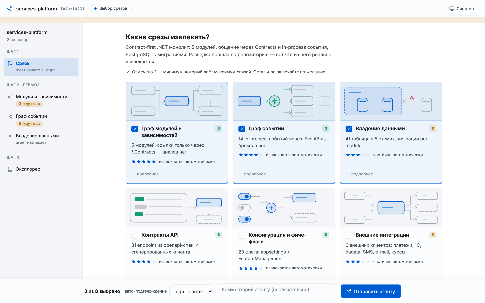
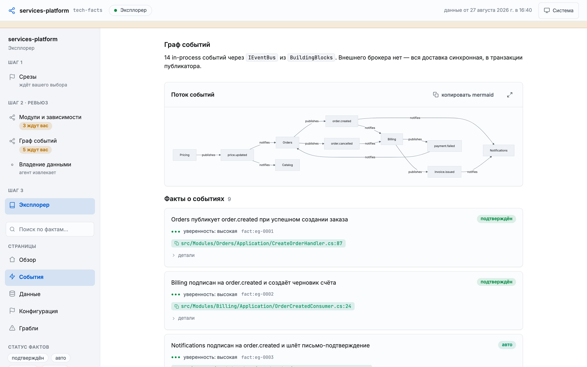
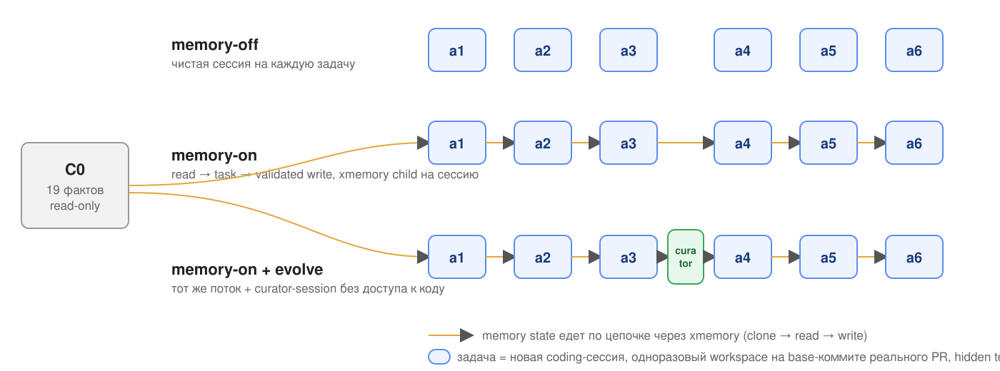
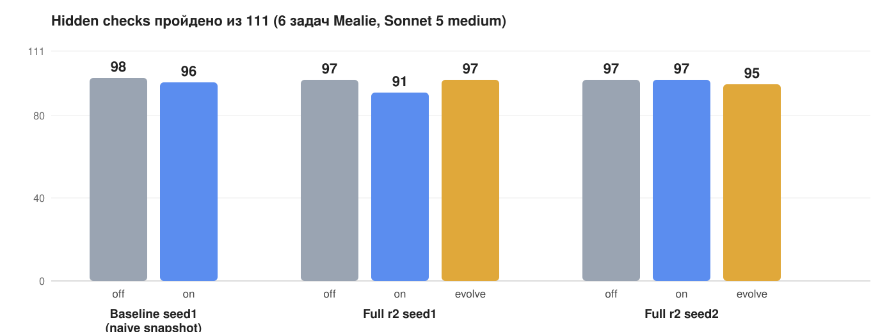

# Системный дизайн как память агента

## Hacker Sprint #2 «Агент, который помнит» · команда kata

Гипотеза, скилл, эвал на реальном репозитории, три волны прогонов и что из этого вышло

github.com/podlodka-ai-club/kata · партнёрская номинация xmemory.ai

<!--
Преза = отчёт. Читается без спикера.
-->

---

## Гипотеза

> Память **технических фактов о системном дизайне** проекта, живущая в xmemory,
> улучшает работу кодового агента: меньше токенов, меньше переделок, меньше архитектурных ошибок.

**Инверсия задачи.** Не проектируем базу знаний заранее: агент **реверс-инжинирит факты из существующего кода**, человек выбирает срезы и ревьюит сомнительное.

**Цикл, который должен замкнуться:**

1. Один раз: скилл строит базу фактов по выбранным срезам и пишет её в xmemory.
2. На каждой задаче: хук читает факты в контекст → агент решает задачу → хук заставляет актуализировать память.
3. Между задачами: curator-сессия дедуплицирует, помечает stale, разрешает противоречия.

Наша работа = **хороший скилл + честный эвал**. Код пишет фронтир-модель.

---

## Скилл `tech-facts`: человек в цикле

**Выбор срезов.** Агент разведывает репозиторий, поднимает локальный UI и предлагает только те срезы системного дизайна, которые в проекте есть. Рекомендует не больше трёх.

**Ревью и эксплорер.** Уверенное агент подтверждает сам, человеку уезжает сомнительное. Сайт над памятью: диаграммы, факты с evidence `файл:строка`, статусы, поиск.

---

## Что лежит в xmemory

| Что | Как |
| --- | --- |
| Схема | Агент проектирует сам под выбранные срезы: **тип объекта на срез** со своими полями, `Entity` для субъектов, связи между ними. Не мешок текста и не одна таблица с полем «тип» |
| Факт | Обязательные `evidence`, `confidence`, `provenance` (declared / observed / inferred), `status` |
| Жизненный цикл | `candidate → active → stale`, ничего не удаляется, только `status_reason` и `superseded_by`. Правило «код прав» |
| След задачи | Объект `Task` со связями `used_facts` / `produced_facts` по `fact_id`. Обходом графа достаётся «факт → задача → изменение» |
| Запись | Только `structured_mutations` через API батчем. Проза через LLM-путь запрещена (почему — в инсайтах) |
| Чтение | SessionStart-хук: scoped top-k активных фактов по срезам задачи, exact ID и содержимое логируются |

Для Mealie на точке C0: 4 среза (`api-contracts`, `invariants`, `data-ownership`, `config-flags`), 19 фактов.

---

## Как проверяли: датасет

**Репозиторий** `mealie-recipes/mealie` (Python, 69 kLOC, настоящие слои routes → services → repos → db). Выбран из шести кандидатов: тесты заводятся на sqlite одной командой, богатая история.

**Задачи** — 6 реальных PR, смерженных после cutoff модели. Формулировка из issue, код на родителе PR, **тесты эталонного PR — скрытая проверка**. Для каждой задачи проверено: null-агент их валит, oracle (код из PR) проходит.

**Что не протекает.** В постановку идут только **имена** (маршрут, env-переменная), но не **архитектура** (в какой слой и по какой конвенции). Архитектура и есть то, что должна давать память.

**Модель** — Claude Sonnet 5, effort medium, Claude Code, свежий workspace на каждый прогон. Из репо вырезаются `AGENTS.md` и `CLAUDE.md`, чтобы не сравнивать с чужой памятью.

**Метрика** — `feature_lift = (agent − null) / (oracle − null)` по тестам, зависящим от фичи. Плюс регрессия, архитектурные проверки путей, токены, стоимость, retrieval precision / coverage.

---

## Как проверяли: три режима

Каждый режим и повтор — своя цепочка xmemory-инстансов от read-only C0. Память переживает рестарт только через xmemory.

---

## Волна 1 · naive snapshot (01.09, 12 прогонов)

Первый end-to-end прогон: `memory-on` получает **один и тот же полный дамп** 19 фактов в каждую задачу, только чтение.

| | memory-off | memory-on |
| --- | ---: | ---: |
| Hidden checks | 98 / 111 | 96 / 111 |
| Полностью решённые задачи | 2 / 6 | 2 / 6 |
| Output-токены | 205k | 166k (−19%) |
| Расчётная стоимость | $18.2 | $13.7 (−24%) |

**Что увидели.** Качество не выросло ни на одной задаче, зато агент с памятью тратил заметно меньше. Разбор показал: 65% экономии — одна задача `a6`, где агент с памятью сделал **меньше и хуже** (1/9 вместо 3/9 и 32 сломанных теста). Экономия «потому что не доделал» — не экономия.

Отсюда два решения: память должна **читаться и писаться**, а факты **отбираться под задачу**.

---

## Волна 2 · cloud-only full r2 (01–02.09, 36 прогонов + 2 curator)

Три режима × 6 задач × 2 повтора. Память только в xmemory: новый child-инстанс на каждую сессию, clone → read → task → validated write.

| | off | on | on+evolve |
| --- | ---: | ---: | ---: |
| Raw feature lift (median) | 0.556 | 0.479 | 0.514 |
| Retrieval precision / coverage | — | 0.28 / 1.0 | 0.28 / 1.0 |
| Стоимость coding | $30.8 | $29.3 | $32.3 |

---

## Волна 2 · что это значит

- **Устойчивого выигрыша нет.** По сырым числам on ниже off, evolve между ними. Между повторами картина меняется: on 91/111 в seed1 и 97/111 в seed2 при том же протоколе. Два повтора не отделяют эффект памяти от дисперсии модели.
- **Coverage 1.0, precision 0.28.** Ожидаемые факты приезжают всегда, но 70% контекста к задаче не относится.
- **Память может сопровождаться вредом.** 5 строк «on хуже off», регрессия после retrieval в 6/12 memory-строк в каждом режиме. Stale-факты при этом не использовались.
- **Curator работает как сервис, но пользы не доказал.** Корректно делал noop / stale / дедуп gotchas, схему без оснований не менял. После checkpoint улучшения на a4–a6 нет.
- **Заранее объявленный gate съел выборку.** 22/36 строк агент правил существующие тесты, 12 — красная регрессия. Eligible осталось 8/36 и ни одной ячейки, где сравнимы все три режима.
- **Learned-факты не извлекались.** Все 24 memory-строки читали только C0: написанное в a1–a3 до a4–a6 не доехало.

---

## Волна 3 · precision canary (02.09, 9 прогонов + curator)

Сужаем гипотезу: **небольшой высокоточный набор** подтверждённых фактов улучшает следующую задачу без регрессии и роста стоимости. Строгий top-k / threshold, C0 отдельно от learned, физически immutable тесты, paired eligibility.

| Задача | off | on | on+evolve |
| --- | ---: | ---: | ---: |
| a1 | 1.000 | 1.000 | 1.000 |
| a4 | 0.600 | 0.600 | 0.600 |
| a6 | 0.333 | 0.333 | 0.111, регрессия red |

- Retrieval precision median **1.0** (было 0.28), контекст 394 токена (было ~1100).
- Парная дельта на a1 и a4 — **ноль**. На a6 evolve сломал 30 тестов ошибкой SQLAlchemy-корреляции в путях, которые ни один факт не описывал. Тот же класс ошибки off-агент делал в full r2: это дисперсия реализации, не действие памяти.
- Стоимость: on **дороже** off на 42% по output-токенам. Gate FAIL, полная матрица не запускалась.

---

<!-- _class: compact -->

## Итог по гипотезе

**Что получили**

- Полный цикл `write → read → write` через xmemory работает между сессиями, процессами и агентами. 31 child-инстанс создан и удалён с receipts, C0 не мутировал.
- Human-in-the-loop, evidence, lifecycle, curator: реализовано и прогонялось.
- Измерительный контур с null / oracle, скрытыми тестами, защитой тестов и attribution «факт → diff».

**Чего не получили**

- Дельты «до / после» в пользу памяти нет ни в одной из трёх волн.
- Экономия токенов не воспроизводится, а в первой волне оказалась артефактом недоделанной задачи.
- Learned transfer (урок из a1–a3 помог в a4–a6) ни разу не активировался доказуемо.

> Долговременная память не становится полезной автоматически. При precision 0.28 лишние факты расширяют пространство интерпретаций, при precision 1.0 их слишком мало, чтобы что-то изменить. Польза приходит из адресного retrieval и проверенных уроков, а не из факта хранения.

---

<!-- _class: compact -->

## Инсайты про подход и эвал

1. **Тесты из PR не всегда меряют.** 4 из 23 кандидатов зелёные ещё до фичи. Проверка null / oracle обязательна на каждую задачу.
2. **Срез `event-graph` в Mealie не измеряется автоматически.** Тесты нотификаторов собираются генератором фикстуры, который молча ест новые поля. Свойство репозитория, не невезение.
3. **Раскрыть контракт = раскрыть факт.** Где тест импортирует ещё не существующий модуль, hidden-test не годится, нужен grep + llm-judge.
4. **Агент правит тесты.** 22 из 36 строк трогали существующие тесты. Сделали их физически immutable (флаги ОС + sandbox + hook) и доказываем pristine до скоринга.
5. **Общие токены врут.** Память должна заменять **разведку**, а не работу: мерить тул-колы до первой правки и долю прочитанного, что реально тронули. Нормировка «токены на пройденную проверку» даёт −6.6% вместо −19%.
6. **Дисперсия модели больше эффекта памяти.** Один контекст в двух повторах даёт разные реализации и регрессии. Без 3+ повторов и paired-сравнения выводов нет.
7. **Отладка дороже эксперимента.** Canary: $29 полезных прогонов при $85 потраченных. За спринт около **$240** расчётного usage.

---

<!-- _class: compact -->

## Инсайты про xmemory

**Что понравилось**

- Реляционная схема под задачу и `structured_mutations`: детерминированная запись батчем за секунды, типизированное чтение.
- Клонирование инстансов даёт дешёвую изоляцию экспериментов: child на сессию, read-only template.
- Очередь schema suggestions из read-трафика и `xmd enhance` для эволюции схемы.

**Что пришлось делать самим**

- Retrieval под задачу: своё ранжирование поверх raw state, потому что `context --text` отдаёт одно и то же на любой запрос, а provider relevance иногда возвращал пусто.
- Трассировку чтений / записей и стоимость операций: через CLI их нет. Клон 4–5 с, запись 5 с.

**На что наткнулись**

- **LLM-путь записи (`write` прозой) рождает объекты-призраки.** На 102 записях: строка с пустым обязательным ключом, 20 лишних связей, осиротевшая связь. Безключевую строку потом не удалить. Для базы, которую агент читает как истину, годится только структурный путь.
- **`read` прозой врёт в подсчётах** («50 Entity» при 49). Сверять множества id через `--read-mode raw`, а не числа.
- **Лимиты:** 5 инстансов на организацию, квота, лимит длины строки (снапшот режем на digest-checked чанки), reserved-поля timestamp в схеме.

---

## Номинация xmemory: самооценка

| Критерий | Как у нас |
| --- | --- |
| Значимый цикл write → read и durability | Есть. Факты пишутся на извлечении и после каждой задачи, читаются следующей сессией; state переживает рестарт только через xmemory. Проверено на 31 child-инстансе |
| Схема под задачу | Есть. Тип объекта на срез, `Entity`, связи между фактами и сущностями, `Task ↔ Fact` |
| xmemory как часть продукта | Есть. Без чтения из xmemory режим `memory-on` не существует |
| Наглядность результата | Частично. Есть эксплорер над памятью и exact attribution «что инжектировано → что заявлено использованным → какие пути diff». Но показать, что память **изменила поведение к лучшему**, не удалось |

---

<!-- _class: compact -->

## Что дальше

- **Уроки из собственной работы, а не из кода.** Основной источник фактов у нас — реверс-инжиниринг. ТЗ просит агента, который учится на своих результатах: `gotcha`-факты из проваленных проверок и регрессий должны стать главным типом памяти.
- **Эвал «полезен ли урок» до активации.** Мини-проверка факта на прошлой задаче перед тем, как он попадёт в контекст следующей.
- **Мерить разведку**, а не общие токены: тул-колы до первой правки, попадание в файлы эталонного PR.
- **Три и больше повторов, paired-сравнение**, вторая модель подешевле для экономического аргумента.
- **Задачи с явной архитектурной конвенцией** (класс B с llm-judge): там, где память обязана помочь, а тесты молчат.

**Скилл + память + эвал собрали. Дельту в пользу памяти не нашли. Зато нашли, почему её так трудно найти.**

github.com/podlodka-ai-club/kata · отчёты `evals/results/` · раннер `dataset/runner/` · скилл `skills/tech-facts/`
Суммы — расчётный usage Claude Code через подписку, не подтверждённое списание.
